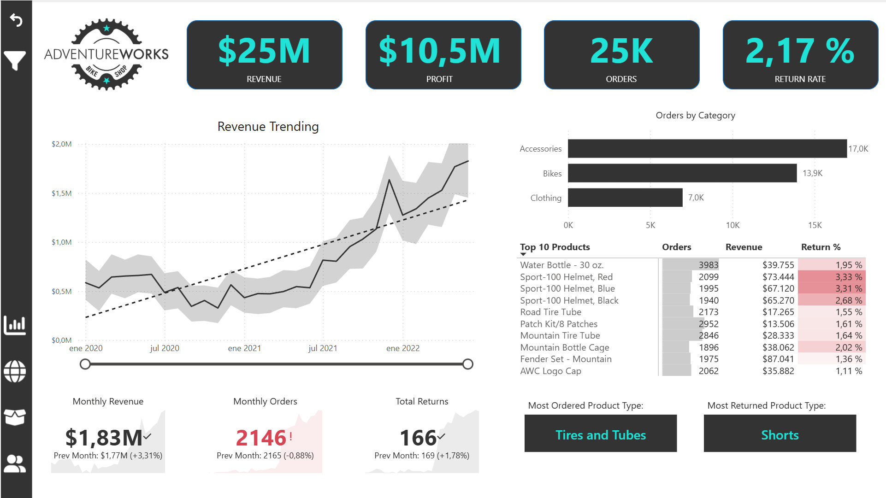
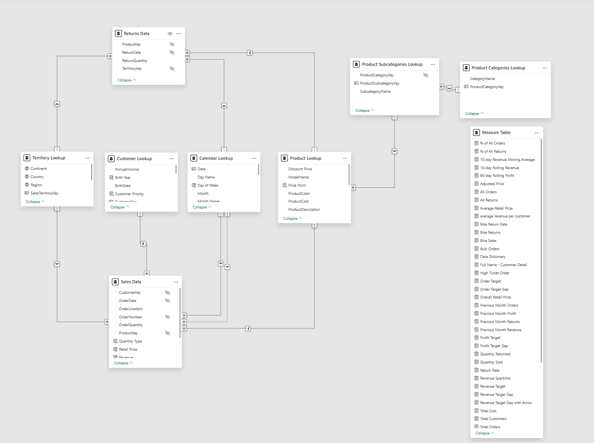
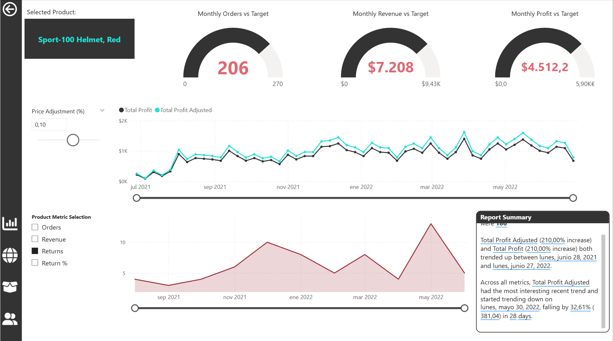
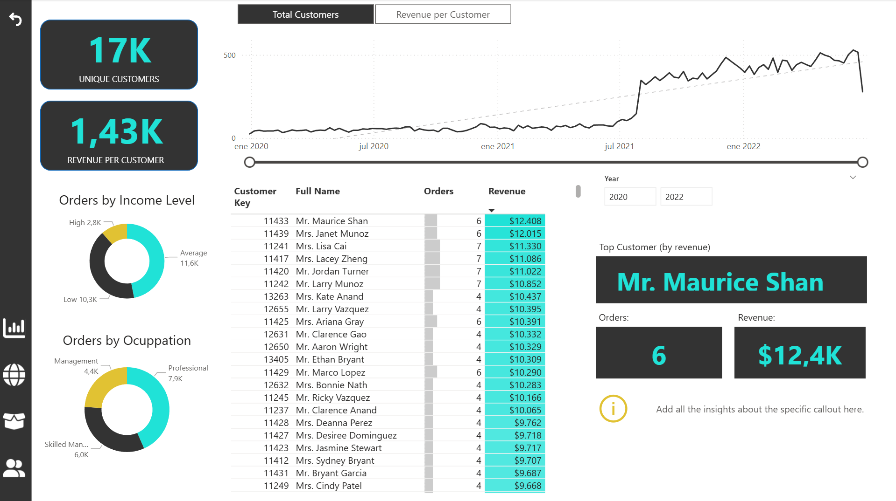
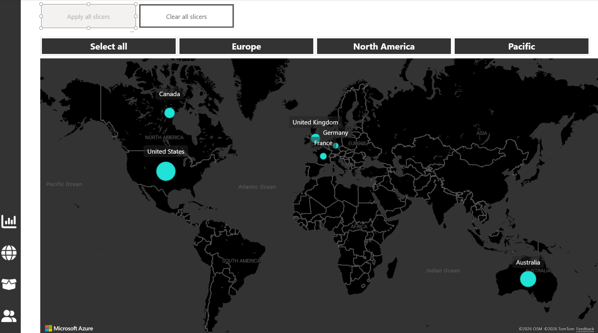
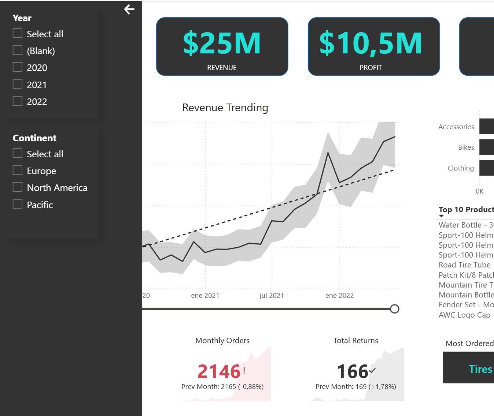

# Adventure Works Sales & Returns Analysis — Power BI


---

## Overview

This project is a comprehensive Business Intelligence solution built in Microsoft Power BI for **Adventure Works**, a global bicycle manufacturing company. The report covers transactional data spanning **2020 to 2022**, integrating sales, returns, customers, products, and territories into a single, unified analytical platform.

The solution was designed to move beyond static spreadsheets and deliver an interactive, self-service reporting experience — empowering stakeholders to explore data independently, monitor business health in real time, and make confident, data-driven decisions.

---

## Business Problem

The management team at Adventure Works faced a common but critical challenge: key business data was scattered across multiple disconnected CSV files — Sales Transactions, Returns, Customers, Products, and Territories. This made it nearly impossible to:

- Track core KPIs (Revenue, Profit, Orders, Return Rate) in a unified view
- Compare performance across regions, product lines, and customer segments
- Identify the root causes of profit loss or elevated return rates
- Perform time-based analysis (YTD, month-over-month comparisons)

**Stakeholders:** Senior management, regional sales managers, and product teams.

**Business Objective:** Transform fragmented raw data into a professional-grade, interactive BI report that enables strategic decision-making at every level of the organisation.

---

## Dataset

| Property | Details |
|---|---|
| **Source** | Adventure Works — publicly available Microsoft sample dataset |
| **Format** | Multiple CSV files |
| **Time Period** | January 2020 – December 2022 |
| **Tables** | Sales Transactions, Returns, Customers, Products, Territories |

**Key Tables & Columns:**

- **Sales Data:** CustomerKey, OrderDate, OrderNumber, ProductKey, OrderQuantity, RetailPrice
- **Returns Data:** ProductKey, ReturnDate, ReturnQuantity, TerritoryKey
- **Customer Lookup:** CustomerKey, AnnualIncome, BirthYear, CustomerPriority, Occupation
- **Product Lookup:** ProductKey, ProductCost, ProductPrice, ModelName, ProductDescription
- **Territory Lookup:** SalesTerritoryKey, Country, Region, Continent
- **Calendar Table:** Dynamically generated via Power Query M-code (Date, Month, Quarter, Year, Week)

> The Adventure Works dataset is a publicly available Microsoft sample. No confidential or sensitive data is included in this repository.

---

## Tools & Technologies

| Tool | Purpose |
|---|---|
| **Microsoft Power BI Desktop** | Primary BI development and visualisation platform |
| **Power Query (M-code)** | Data extraction, transformation, and loading (ETL) |
| **DAX (Data Analysis Expressions)** | Calculated measures, KPIs, and time intelligence |
| **Star Schema Modelling** | Data model design for performance and scalability |
| **Row-Level Security (RLS)** | Report governance and regional access control |
| **Power BI Bookmarks & Buttons** | Custom navigation and UX design |

---

## Project Workflow

### 1. Data Collection
Connected Power BI directly to the raw CSV source files: Sales Transactions, Returns, Products, Customers, and Territories.

### 2. Data Cleaning & Transformation (ETL — Power Query)
- Removed duplicate records and handled missing values to ensure data integrity
- Standardised data types and column headers across all tables
- Created a **dynamic rolling Calendar table** using Power Query M-code to enable full time intelligence (Year, Quarter, Month, Week)
- Added **Conditional Columns** for customer demographic categorisation (Income Level, Parent Status, Customer Priority)

### 3. Data Modelling
- Designed a **Star Schema** with two Fact tables (Sales, Returns) and five Dimension tables (Products, Customers, Calendar, Territories, Product Subcategories)
- Established **One-to-Many relationships** with correct filter direction propagation
- Hidden all foreign keys and technical columns to maintain a clean, user-facing model view
- Created a dedicated **Measure Table** to organise all DAX calculations

### 4. Advanced DAX Calculations
- **Core Measures:** Total Revenue, Total Cost, Total Profit, Total Orders, Quantity Returned
- **Time Intelligence:** YTD Revenue, Previous Month Revenue, Previous Month Orders, Previous Month Returns, 10-Day Rolling Revenue, 90-Day Rolling Profit
- **Efficiency Ratios:** Return Rate %, Profit Margin %
- **Dynamic Measures:** % of All Orders, % of All Returns using `ALL()` and `CALCULATE()`
- **Targets & Gaps:** Order Target, Revenue Target, Profit Target, Target Gap measures
- **What-If Parameters:** Adjusted Price, Total Profit Adjusted (Price Adjustment simulation)

### 5. Dashboard Design & Visualisation
Designed a 4-page interactive report with a cohesive dark theme, custom navigation bar, and app-like UX:

| Page | Description |
|---|---|
| **Executive Dashboard** | High-level KPI cards, revenue trend, orders by category, top 10 products table |
| **Map & Territory Analysis** | Geospatial sales distribution across North America, Europe, and Pacific |
| **Product Detail** (Drillthrough) | Per-product performance, What-If price simulation, field parameter KPI toggle |
| **Customer Analysis** | Segmentation by income and occupation, top customers, revenue per customer trends |

### 6. Advanced Features & Governance
- **Custom Page Navigation:** Button-based navigation bar with bookmarks (no default tabs)
- **Collapsible Slicer Panel:** Bookmark-driven filter panel to keep the canvas clean
- **Drill-Through Pages:** Right-click from Executive Dashboard to access Product Detail
- **Custom Tooltips:** Hover tooltips showing mini-charts and contextual KPIs
- **Drill-Up / Drill-Down:** Hierarchical exploration (Year > Quarter > Month; Country > State > City)
- **Anomaly Detection:** Applied to revenue time-series to flag statistical outliers automatically
- **Row-Level Security (RLS):** DAX-based roles configured (e.g., "Europe Manager" role filters data by region on login)
- **Edit Interactions:** Controlled slicer interactions to ensure stable KPI cards alongside dynamic charts

---

## Key Features

- **Interactive 4-Page Report** with custom app-like navigation (no default Power BI tabs)
- **KPI Tracking** — Revenue, Profit, Orders, and Return Rate with month-over-month comparison indicators
- **Star Schema Data Model** optimised for performance and scalability
- **Advanced DAX Measures** — Time intelligence, rolling averages, and dynamic ratio calculations
- **What-If Price Simulation** — Numeric parameter slider to model the revenue/profit impact of price adjustments
- **Field Parameters** — Dynamic axis toggle between Orders, Revenue, Returns, and Return % on a single visual
- **Collapsible Slicer Panel** — Clean canvas design with hidden filters (Year, Continent slicers)
- **Drillthrough Navigation** — Contextual deep-dive from summary to product-level detail
- **Custom Tooltips** — Hover-over mini-charts providing instant insight without changing views
- **Anomaly Detection** — AI-powered outlier flagging on revenue time-series charts
- **Row-Level Security (RLS)** — Regional access control for secure stakeholder reporting
- **Geospatial Analysis** — Map visual showing sales distribution across global territories

---

## Screenshots

> Screenshots are located in the `/screenshots` folder. Add your own exports from Power BI Desktop for each view.

### Executive Dashboard

*High-level KPI cards (Revenue, Profit, Orders, Return Rate), revenue trend line, orders by category, and top 10 products table.*

### Data Model — Star Schema

*Star schema design showing Fact tables (Sales, Returns) connected to Dimension tables (Calendar, Customers, Products, Territories).*

### Product Detail — Drillthrough Page

*Drillthrough page with What-If price adjustment slider and field parameter KPI toggle for dynamic metric exploration.*

### Customer Analysis

*Customer segmentation by income level and occupation, top customers by revenue, and revenue per customer trends.*

### Map & Territory Analysis

*Geospatial sales distribution across North America, Europe, and the Pacific region.*

### Collapsible Slicer Panel

*Bookmark-driven collapsible filter panel keeping the canvas clean when filters are not in use.*

---

## Insights

The following insights are derived from the structure and metrics visible in this report:

- **Accessories drive order volume** — The Accessories category leads with the highest number of orders, making it the primary revenue contributor by transaction count across the 2020–2022 period.
- **Return rates vary significantly by product type** — Clothing (e.g., Shorts) is identified as the most returned product type, suggesting a potential sizing, quality, or expectation mismatch that warrants further investigation.
- **Revenue shows consistent upward trajectory** — The monthly revenue trend indicates sustained growth from 2020 through 2022, with the most recent months reaching peak monthly revenue values.
- **High-income customers generate disproportionate revenue** — Customer segmentation reveals that high-income brackets contribute a significantly higher revenue per customer compared to average and low-income segments.
- **Price sensitivity simulation indicates margin opportunity** — The What-If price adjustment analysis demonstrates that even a modest 10% price increase on select products could materially improve total profit, with limited projected impact on order volume.

---

## Project Structure

```
adventure-works-sales-returns-powerbi/
│
├── README.md
│
├── documentation/
│   └── project-description.pdf
│
├── screenshots/
│   ├── 01-executive-dashboard.png
│   ├── 02-data-model-star-schema.png
│   ├── 03-product-detail-drillthrough.png
│   ├── 04-customer-analysis.png
│   ├── 05-territory-map.png
│   └── 06-collapsible-slicer-panel.png
├── data/
│   ├── README-data.md
```

---

## Author

**Created by:** Hector Martin  
**Role:** Data Analyst  
**Location:** Ireland  

---

*For questions or collaboration opportunities, feel free to connect via LinkedIn.*
