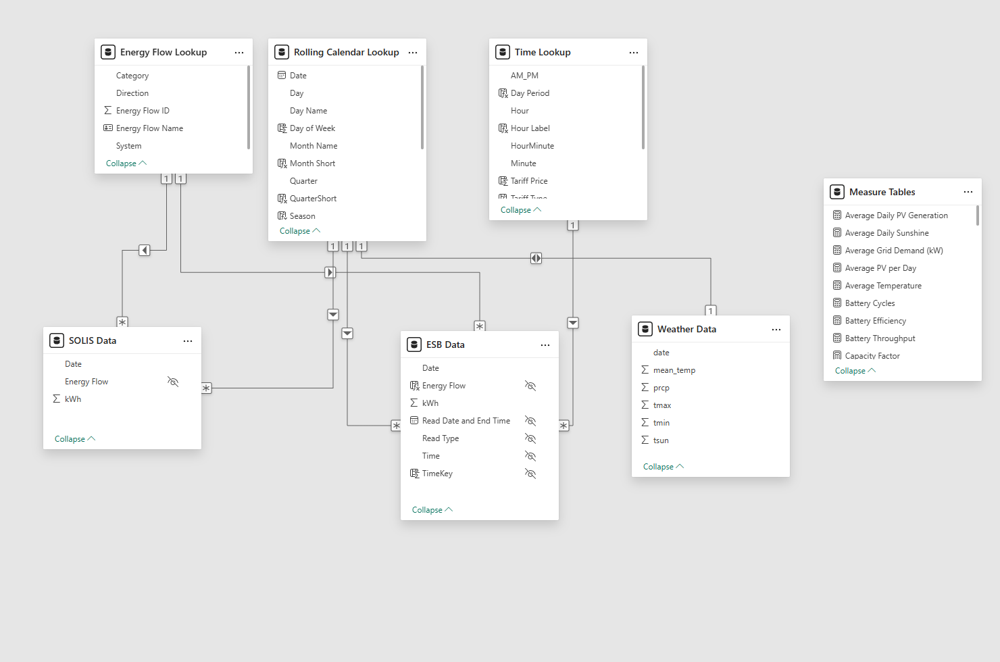
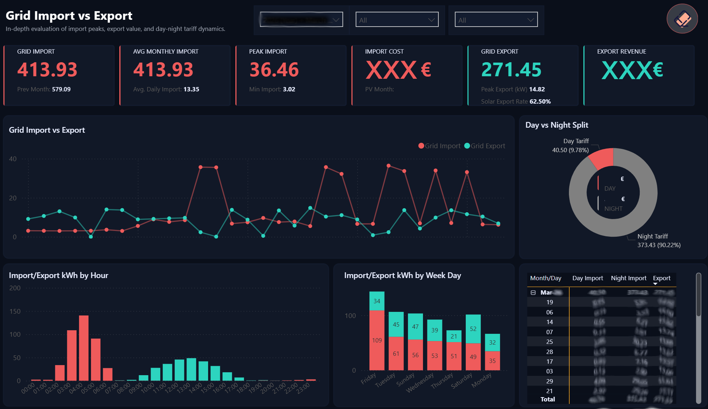
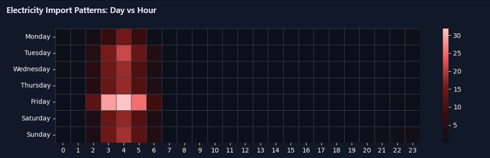

# Energy Consumption & Solar Production Analytics — ESB & SolisCloud


---

## Overview

This project delivers a complete end-to-end Power BI analytics solution designed to monitor and optimize residential energy consumption, solar generation, battery performance, and electricity costs.

By integrating multiple real-world data sources — including grid electricity usage from ESB, photovoltaic (PV) system performance from SolisCloud, and weather conditions from the Meteostat API — the solution provides a unified analytical platform to track energy flows, evaluate system efficiency, and identify cost-saving opportunities.

The project demonstrates the full data lifecycle: data ingestion, transformation, feature engineering, KPI development, visualization, and reporting — all implemented within Microsoft Power BI.

---

## Business Problem

Energy consumption costs and renewable energy adoption are increasingly influenced by usage behavior, weather patterns, and system performance. However, data from energy providers, solar systems, and weather services is typically stored in separate systems with inconsistent formats, making it difficult to understand overall energy efficiency and financial impact.

**This project aimed to build a centralized analytics solution capable of:**

- Tracking electricity import and export from the grid
- Monitoring solar generation and battery usage
- Calculating total electricity costs and savings
- Understanding energy consumption patterns by time of day and season
- Evaluating the impact of weather conditions on solar production
- Providing operational insights into energy efficiency

---

## Dataset

**Data Sources:**

| Source | Description | Key Fields |
|--------|-------------|------------|
| **ESB (Electricity Supply Board)** | Grid electricity import/export data (kWh), tariff information, cost and revenue calculations | Energy Flow, kWh, Read Date, Read Type, Time, Tariff Price |
| **SolisCloud (Solar Inverter)** | Solar generation, battery charge/discharge activity, load consumption, system performance | Date, Energy Flow, kWh |
| **Meteostat API** | Temperature, sunshine duration, precipitation levels | Date, Mean Temp, Precipitation, Tmax, Tmin, Sunshine Hours |

> **Note:** Due to confidentiality, data is not included. The dataset contains personally identifiable energy usage and financial information that cannot be shared publicly.

---

## Tools & Technologies

| Tool / Technology | Purpose |
|-------------------|---------|
| **Microsoft Power BI** | Dashboard design, data modeling, reporting |
| **Power Query (M Language)** | Data extraction, cleaning, and transformation (ETL) |
| **DAX (Data Analysis Expressions)** | KPI calculations, time intelligence, advanced measures |
| **Python (Seaborn)** | Advanced statistical visualizations (heatmaps) embedded in Power BI |
| **Meteostat REST API** | Weather data ingestion |
| **Star Schema Modeling** | Optimized relational data model design |

---

## Project Workflow

1. **Data Extraction** — Ingested data from three independent sources: ESB grid data, SolisCloud solar/battery data, and Meteostat weather API.
2. **Data Cleaning & Transformation** — Used Power Query to clean missing records, standardize timestamps, remove duplicates, correct data types, unpivot energy flow columns, and create derived fields (day/night tariff classification, weather metrics).
3. **Data Modeling** — Designed a Star Schema with 7 tables (3 fact tables, 4 dimension tables) with one-to-many relationships optimized for performance and scalability.
4. **KPI Development** — Built a comprehensive DAX measures framework covering energy metrics, financial metrics, solar and battery performance, time intelligence, and weather analytics.
5. **Dashboard Design** — Created 9 interactive report pages with custom navigation, drillthrough analysis, custom tooltips, and managed visual interactions.
6. **Advanced Visualizations** — Integrated Python Seaborn heatmaps within Power BI to extend analytical capability beyond standard visuals.

---

## Key Features

- **9 Interactive Dashboard Pages** — Energy Overview, Detailed Metrics, Solar & Battery Performance, Grid Import vs Export, Cost & Revenue, Table Summary, Daily Drillthrough, Time Intelligence, Weather Impact
- **Star Schema Data Model** — 7-table optimized model with clean semantic layer
- **Comprehensive KPI Framework** — 30+ DAX measures across energy, financial, solar, battery, time intelligence, and weather categories
- **Python Integration** — Seaborn heatmap showing electricity import patterns by day and hour
- **Custom UX Design** — Application-style navigation with bookmarks, drillthrough pages, custom tooltips, and electricity-themed color palette
- **Time Intelligence** — MoM, YoY, YTD, and Rolling 12-Month trend analysis
- **Weather Impact Analysis** — Correlation between temperature, sunshine, precipitation, and energy performance

---

## Data Model

The solution uses a **Star Schema** consisting of 7 tables:

**Fact Tables:**
- ESB Data — Grid import/export measurements
- SOLIS Data — Solar generation and battery metrics
- Weather Data — Daily weather observations

**Dimension Tables:**
- Energy Flow Lookup — Category, Direction, System classification
- Rolling Calendar Lookup — Date, Day Name, Month, Quarter, Season
- Time Lookup — Hour, Minute, Day Period, Tariff Price, AM/PM
- Measures Table — Centralized DAX measures



---

## Dashboard Pages

| # | Page | Description |
|---|------|-------------|
| 1 | **Energy Overview** | Executive dashboard with grid import/export, PV generation, battery throughput, net cost, and Python heatmap |
| 2 | **Detailed Metrics View** | Focused analysis for individual energy metrics with day vs night consumption |
| 3 | **Solar & Battery Performance** | Solar generation vs load, battery charge/discharge patterns, efficiency, and solar savings |
| 4 | **Grid Import vs Export** | Import vs export comparison, tariff breakdown, hourly and weekday patterns |
| 5 | **Cost & Revenue Analysis** | Total cost, export revenue, net cost, cumulative trends, solar value |
| 6 | **Table Summary** | Comprehensive tabular view of all calculated metrics for validation |
| 7 | **Daily Details (Drillthrough)** | Hourly analysis for specific dates supporting root cause investigation |
| 8 | **Time Intelligence** | YTD, Rolling 12-Month, MoM, and YoY cost trend analysis |
| 9 | **Weather Impact** | Temperature vs consumption, sunshine vs generation, precipitation vs load |

---

### Preview





---

## Insights

> Detailed analytical findings have been intentionally omitted to comply with data privacy and responsible data handling principles, as the dataset contains personally identifiable energy usage and financial information.

**General analytical capabilities enabled by this solution include:**

- Identification of peak and off-peak electricity consumption patterns by hour and day of week
- Evaluation of day vs night tariff usage distribution and cost optimization opportunities
- Monitoring of solar self-consumption rates and grid export efficiency
- Assessment of battery charge/discharge cycles and throughput efficiency
- Correlation analysis between weather conditions (sunshine hours, temperature) and PV generation output
- Month-over-month and year-over-year cost trend tracking for financial planning

---

## Project Structure

```
energy-consumption-solar-production-powerbi/
│
├── README.md
│
├── documentation/
│   └── project-description.pdf
│
├── data/
│   └── DATA_NOTE.md
│
├── dashboards/
│   └── DASHBOARD_NOTE.txt
│
├── screenshots/

```

---

## Author

**Created by:** Hector Martin
**Role:** Data Analyst
**Location:** Ireland

---

## License

This project is part of a professional data analytics portfolio. The dashboard design, DAX measures, data model architecture, and documentation are original work. Source data is not included due to privacy constraints.
