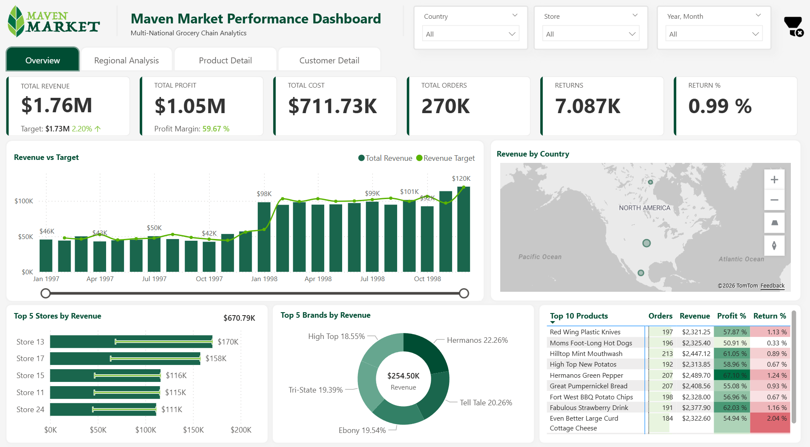
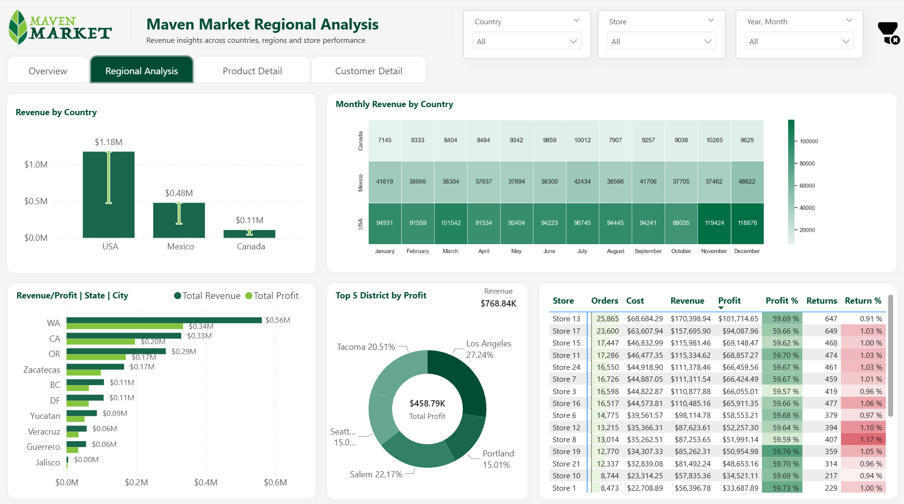
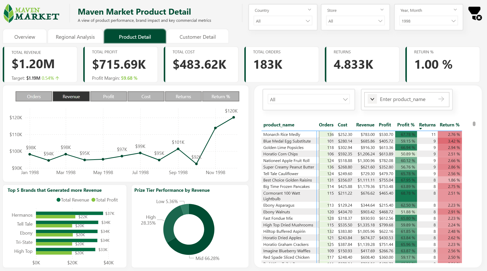
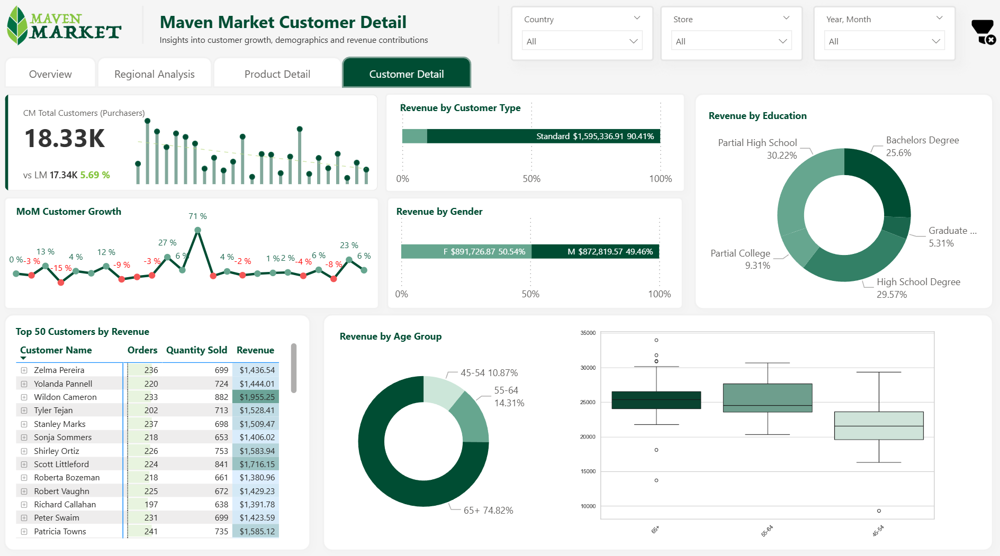
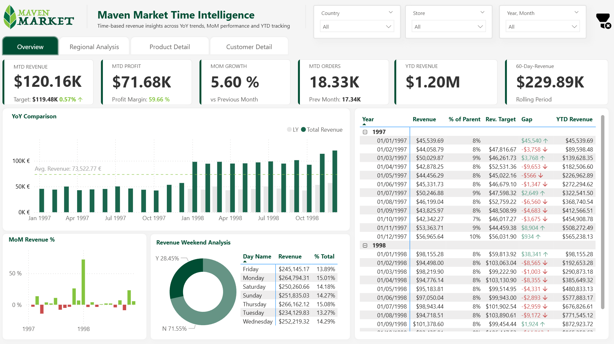
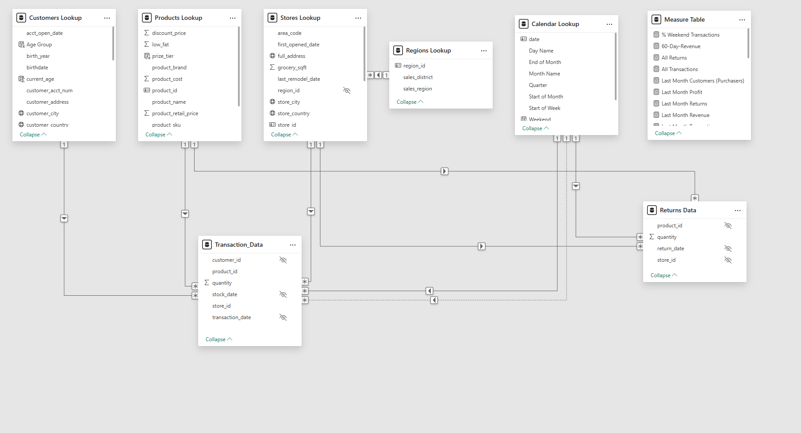

# Maven Market Retail Performance Analysis – Power BI

<p align="center">
  
</p>

<p align="center">
  
  
  
  
  
</p>

---

## Overview

The **Maven Market Retail Performance Dashboard** is an end-to-end Business Intelligence solution built in Microsoft Power BI for a multinational grocery retailer operating across the **United States, Canada, and Mexico**.

By integrating transactional, customer, product, and store-level data, this solution delivers a **360° analytical view** of revenue performance, profitability, customer demographics, product returns, and time-based growth trends.

The report empowers executives and regional managers to monitor KPIs, evaluate store performance, analyse customer behaviour, and track revenue against strategic targets — all within a single, interactive reporting environment.

---

## Business Problem

Maven Market operates grocery stores of varying sizes across North America. Without a centralised reporting solution, extracting meaningful insights from raw, siloed data was time-consuming and inefficient.

**Key challenges addressed:**

- Revenue and profitability were tracked manually without a unified data model
- No standardised way to compare store or regional performance
- Product return rates and margin trends were not consistently monitored
- Customer demographic analysis was unavailable
- Time-based KPI tracking (YoY, MoM, YTD) required manual calculation

**Stakeholders:** Executive leadership, regional managers, commercial and operations teams

**Business Objective:** Build a scalable, professional BI solution that enables data-driven decision-making across all levels of the organisation.

---

## Dataset

| Detail | Description |
|---|---|
| **Source** | Maven Market structured dataset (multinational grocery chain) |
| **Countries** | United States, Canada, Mexico |
| **Tables** | Transactions, Returns, Customers, Products, Stores, Regions, Calendar |
| **Model Type** | Star Schema (2 Fact Tables + 5 Dimension Tables + Measures Table) |
| **Time Period** | 1997–1998 |
| **Volume** | Hundreds of thousands of transactional records |

**Key Columns:**
- `transaction_date`, `product_id`, `store_id`, `customer_id`, `quantity`, `revenue`
- `return_date`, `quantity_returned`
- `customer_country`, `birth_year`, `education`, `customer_city`
- `product_name`, `brand`, `product_cost`, `product_retail_price`, `price_tier`
- `store_country`, `store_city`, `store_sqft`, `grocery_sqft`


---

## Tools & Technologies

| Tool / Technology | Purpose |
|---|---|
| **Microsoft Power BI Desktop** | Dashboard development and report publishing |
| **Power Query (M Language)** | Data extraction, transformation, and loading (ETL) |
| **DAX (Data Analysis Expressions)** | KPI measures, time intelligence, and calculated columns |
| **Python – Seaborn** | Advanced custom visualisations (Heatmap, Boxplot) |
| **Star Schema Modelling** | Relational data model design and optimisation |
| **Excel / CSV** | Source data format |

---

## Project Workflow

### 1. Data Collection
Connected to structured CSV source files covering transactions, returns, customers, products, stores, regions, and calendar data.

### 2. Data Cleaning & Transformation (Power Query)
- Removed duplicates and handled null/missing values
- Standardised column names, data types, and formats
- Created calculated columns for demographic grouping: `Age Group`, `Education Level`
- Built a structured `Calendar` table to support advanced time intelligence

### 3. Data Modelling (Star Schema)
Designed an optimised Star Schema with **8 tables**:

- **Fact Tables:** `Transaction_Data`, `Returns_Data`
- **Dimension Tables:** `Customers_Lookup`, `Products_Lookup`, `Stores_Lookup`, `Regions_Lookup`, `Calendar_Lookup`
- **Measures Table:** Centralised DAX measure repository

Key features: one-to-many relationships, proper filter propagation, hidden foreign keys, and optimised cardinality.

### 4. DAX Measure Development
Built a comprehensive KPI framework including:
- Core metrics: Revenue, Cost, Profit, Transactions, Returns, Quantity
- Efficiency KPIs: Profit Margin %, Return Rate %, Revenue Target Gap
- Time Intelligence: YTD, MoM %, Last Month, YoY, 60-Day Rolling Revenue
- Customer metrics: Total Customers, MoM Customer Growth

### 5. Dashboard Design & Visualisation
Developed **5 interactive report pages** with custom navigation, drill-down capabilities, dynamic field parameters, and Python-powered visuals.

### 6. Insights Generation
Translated data patterns into actionable business insights covering revenue seasonality, geographic performance, product profitability, customer demographics, and weekly trading patterns.

---

## Dashboard Pages

| Page | Description |
|---|---|
| **Executive Dashboard** | High-level KPI overview: Revenue vs Target, Top Stores, Top Brands, Country map |
| **Regional Analysis** | Drill-down from Country → Region → Store with comparative performance |
| **Product Detail** | Product-level revenue, profitability, return rates, and dynamic KPI selector |
| **Customer Detail** | Customer growth trends, demographic segmentation, top 50 customers by revenue |
| **Time Intelligence** | YoY trends, MoM %, YTD, 60-Day Rolling Revenue, Weekend Analysis |

---

## Key Features

- ✅ **5-page Interactive Dashboard** with seamless app-like navigation
- ✅ **Star Schema Data Model** with 8 optimised tables
- ✅ **30+ DAX Measures** covering commercial, time intelligence, and customer KPIs
- ✅ **Revenue vs Target Tracking** with dynamic gap indicators and directional arrows
- ✅ **Drill-Down Geography** — Country → Region → Store hierarchy
- ✅ **Dynamic Field Parameters** — toggle between Revenue, Profit, Transactions, Returns
- ✅ **Custom Tooltips** for contextual micro-insights on hover
- ✅ **Python Integration** — Seaborn Heatmap (Revenue by Country vs Month) and Boxplot (Revenue by Age Group)
- ✅ **Time Intelligence** — YTD, YoY, MoM %, Last Month comparisons, 60-Day Rolling Revenue
- ✅ **Customer Segmentation** — Demographics by Age Group, Gender, Education Level
- ✅ **Managed Visual Interactions** to preserve KPI card integrity

---

## Screenshots

### Executive Dashboard


### Regional Analysis Page


### Product Detail Page


### Customer Detail Page


### Time Intelligence Page


### Data Model – Star Schema


---

## Key Insights

1. **Revenue Target Achieved:** Maven Market generated **$1.2M in total revenue** in 1998, exceeding its annual target by **+0.54%**, with a strong **59.68% profit margin** reflecting effective cost control.

2. **Seasonal Dependency:** December was the highest-performing month for revenue and profit. Only four months (January, September, November, December) exceeded the revenue target, indicating a significant seasonal concentration risk.

3. **Geographic Performance Disparity:** The United States led in total revenue ($0.61M across 13 stores), but **Mexico demonstrated superior per-store efficiency** — Store 12 (Mexico) ranked as the highest-performing individual store by both revenue and profit.

4. **Customer Concentration Risk:** The **65+ age segment contributes approximately 75% of total revenue** across all three countries. This structural dependency on senior customers presents both a retention priority and a strategic opportunity to grow younger segments.

5. **Mid-Week Revenue Peak:** Thursday (15.11%), Monday (15.03%), and Wednesday (14.87%) form the strongest trading days. Staffing, promotions, and inventory strategies should be aligned with this mid-week demand pattern.

---

## Project Structure

```
maven-market-retail-performance-powerbi/
│
├── README.md                        # Project documentation (this file)
│
├── documentation/
│   └── project-description.pdf      # Full project documentation
│
├── data/
│   └── Maven+Market+CSV+Files.zip              # ZIP that contains all csv files
│
├── dashboards/
│   ├── maven-market-dashboard-readme.txt  
│   └── dashboard-layout.json        # Dashboard layout reference
│
├── screenshots/
│   ├── dashboard-overview.png       # Executive dashboard screenshot
│   ├── reginal-analysis.png         # Regional detail page screenshot
│   ├── product-detail.png           # Product detail page screenshot
│   ├── customer-detail.png          # Customer detail page screenshot
│   ├── time-intelligence.png        # Time intelligence page screenshot
│   └── data-model.png               # Star schema data model screenshot

```

---

## Author

**Created by:** Hector Martin  
**Role:** Data Analyst | Business Intelligence Developer  
**Location:** Ireland  
**Tools:** Power BI · DAX · Power Query · Python

---

*This project is part of a professional data analytics portfolio (Maven Analytics course) demonstrating end-to-end BI development skills including data modelling, DAX measure authoring, dashboard design, and Python integration.*
