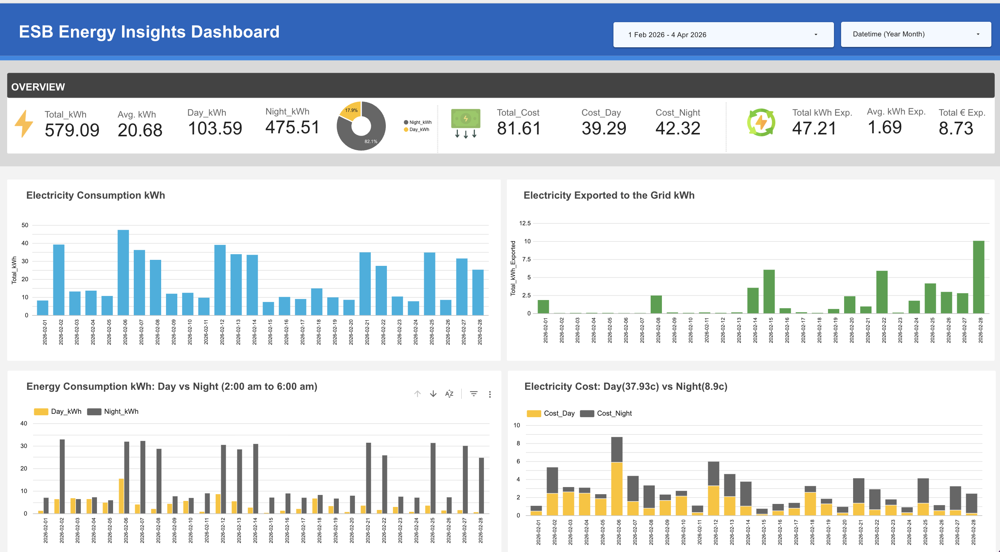
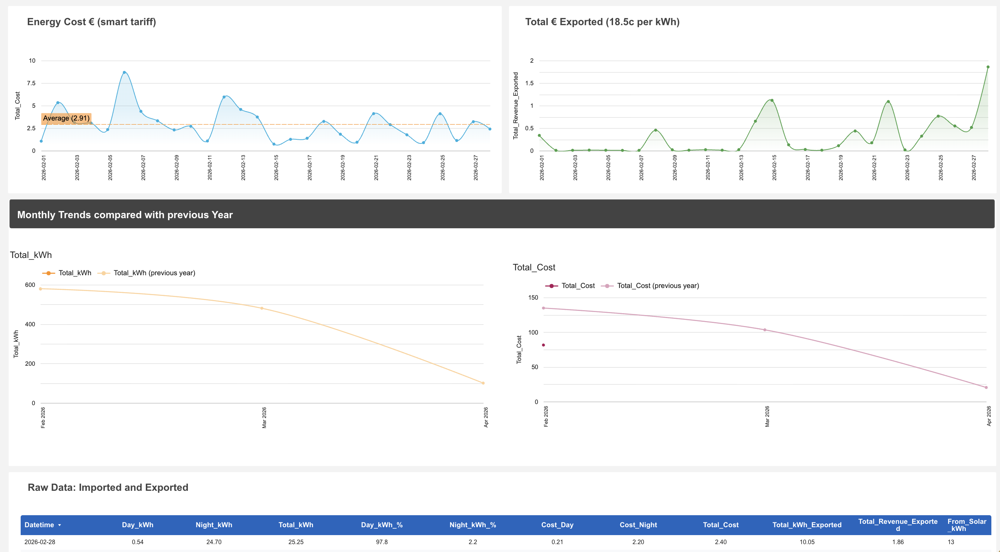
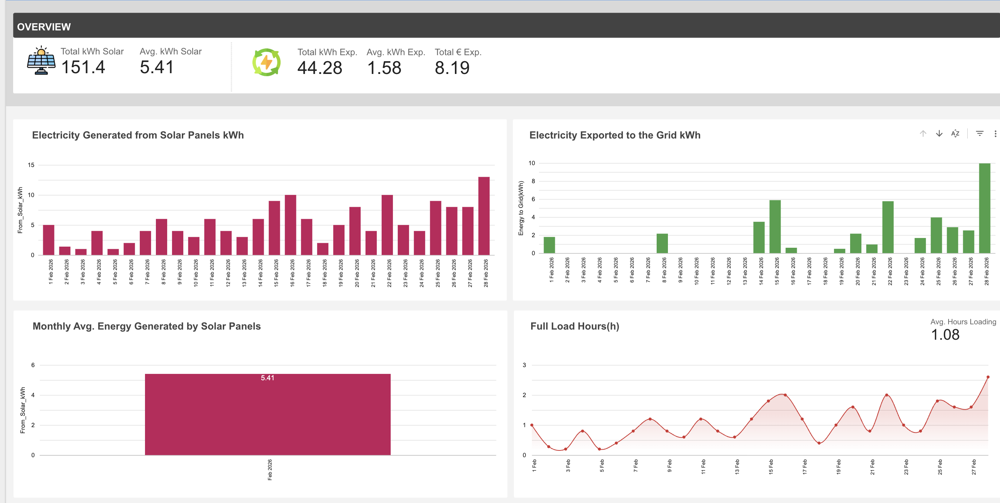
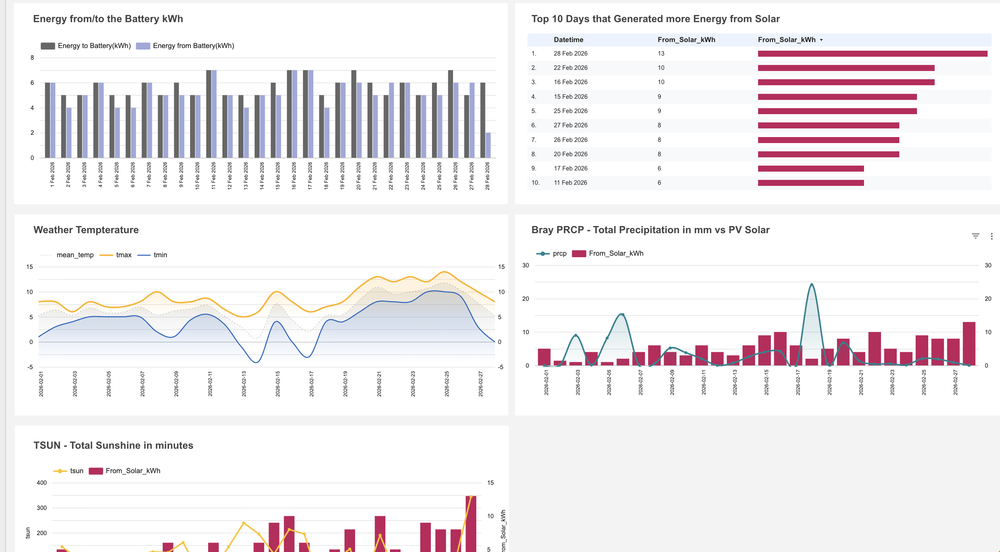

# Energy Consumption & Solar Production Analysis


---

## Overview

This project delivers a complete end-to-end energy data analytics pipeline, combining electricity consumption data, solar PV production data, and weather information into a unified reporting system. The pipeline spans data ingestion, cleaning, feature engineering, KPI calculation, and dashboard publication in Google Looker Studio.

The project was developed as a real-world personal energy monitoring solution and serves as a portfolio demonstration of Python data engineering and business intelligence skills.

---

## Business Problem

Rising energy costs and growing adoption of residential solar systems create a genuine need for granular energy monitoring and optimisation. Standard supplier portals provide only summary-level data and do not differentiate between smart tariff periods, making it difficult to understand actual energy costs and solar efficiency.

**This project addresses the following questions:**

- How much electricity is imported from the grid, and when (day vs. night smart tariff)?
- How much energy is generated by the solar PV system daily and monthly?
- What proportion of solar production is self-consumed versus exported to the grid?
- How does weather (temperature, sunshine, precipitation) correlate with solar output?
- What is the actual cost of electricity after factoring in smart tariffs and solar export revenue?

**Stakeholders:** Residential energy consumers, energy analysts, and professionals interested in renewable energy data pipelines.

---

## Dataset

### Data Sources

| Source | Type | Description |
|---|---|---|
| ESB (Electricity Supply Board) | CSV | 30-minute interval import/export meter readings in kWh |
| SolisCloud | XLS | Daily solar inverter metrics including PV yield, battery charge/discharge, grid interaction |
| Meteostat API | API (JSON) | Daily weather data: min/max temperature, total sunshine minutes, precipitation |

### Key Columns — ESB Data

| Column | Description |
|---|---|
| `Datetime` | Timestamp at 30-minute intervals |
| `Read Type` | Active Import or Active Export interval |
| `kWh` | Energy value per interval |


### Key Columns — SolisCloud Data

| Column | Description |
|---|---|
| `Today Yield (kWh)` | Daily energy generated by the inverter |
| `Today Full Load Hours (h)` | Inverter efficiency indicator |
| `Energy to Grid (kWh)` | Daily solar export to the grid |
| `Energy from Grid (kWh)` | Daily import from the grid |
| `Energy to Battery (kWh)` | Energy stored in battery |
| `Energy from Battery (kWh)` | Energy discharged from battery |
| `Load Consumption (kWh)` | Total household consumption |
| `Generation (kWh)` | Total generation metric |

> **Note:** Due to data confidentiality, only sample data placeholders are included in this repository. The full dataset is available on request.

---

## Tools & Technologies

- **Python 3.10+** — Core scripting and data processing
- **pandas** — Data loading, cleaning, transformation, and aggregation
- **Matplotlib & Seaborn** — Static chart generation for Excel reports
- **Plotly Express** — Interactive exploratory visualisations
- **openpyxl** — Structured Excel report generation with embedded charts
- **Meteostat API** — Weather data retrieval via REST API
- **Google Looker Studio** — Interactive dashboard publication
- **Jupyter Notebook** — Analysis environment and documentation
- **Excel (via pandas ExcelWriter)** — Multi-sheet structured data export

---

## Project Workflow

### Step 1 — Data Ingestion
Raw data is loaded from three independent sources: ESB CSV exports (30-minute meter intervals), SolisCloud monthly XLS inverter reports, and Meteostat weather API responses. Column names are standardised and datetime fields are parsed with explicit format strings to avoid locale-related parsing errors.

### Step 2 — Data Cleaning & Quality Checks
Each dataset is validated for null values, duplicates, and type inconsistencies. Datetime format inconsistencies (`YYYY-00-DD` edge cases) are resolved using `pd.to_datetime` with explicit `format` parameters. Numeric fields are cast to appropriate float/int types.

### Step 3 — Feature Engineering & KPI Calculation
New derived fields are computed on top of the cleaned data:

- **Tariff classification** — Each 30-minute ESB interval is labelled Day or Night based on the Energia smart tariff schedule (Night: 02:00–06:00)
- **Cost per interval** — Applied at `€0.3793/kWh` (Day) and `€0.089/kWh` (Night)
- **Export revenue** — Calculated at the current microgeneration export rate of `€0.185/kWh`
- **From Solar (direct self-consumption)** — Derived without double-counting battery flows
- **Solar % and Grid %** — Self-consumption ratios per day

### Step 4 — Data Transformation & Aggregation
Data is reshaped using `pivot_table` and `melt` to produce day/night breakdowns suitable for donut and stacked bar charts. Daily and monthly summary tables are produced for both ESB and SolisCloud datasets.

### Step 5 — Export to Structured Excel Reports
Processed tables and charts are exported to multi-sheet Excel workbooks using `pandas ExcelWriter` with `openpyxl`. Datetime columns are explicitly formatted to prevent Excel's auto-conversion issues. Charts generated via Matplotlib are embedded directly into the relevant workbook sheets.

### Step 6 — Dashboard Publication (Google Looker Studio)
Pre-aggregated Excel output tables are connected to Google Looker Studio as data sources. The dashboard includes time-series charts, day/night tariff breakdowns, solar self-consumption KPIs, battery flow analysis, weather correlation overlays, and monthly trend comparisons against prior year data.

---

## Key Features

- **Smart Tariff Breakdown** — Accurate day vs. night consumption and cost split using Energia smart tariff rates
- **Solar Self-Consumption Analysis** — Correctly derived direct solar usage, separating battery and grid flows
- **Export Revenue Tracking** — Automatic calculation of microgeneration income at current government rates
- **Weather Correlation** — Overlay of Meteostat temperature, sunshine minutes, and precipitation against PV output
- **Battery Flow Monitoring** — Charge and discharge cycle tracking for battery efficiency analysis
- **Monthly Trend Comparison** — Current vs. prior year monthly consumption and cost benchmarking
- **Automated Excel Reporting** — Multi-sheet workbooks with embedded charts generated programmatically
- **Interactive Looker Studio Dashboard** — Published dashboard with date filters and drill-down capability

---

## Screenshots

### ESB Energy Insights Dashboard

**Dashboard Overview**




*Full ESB dashboard showing KPI summary, electricity consumption, day/night tariff split, energy costs, grid export revenue, and monthly trend comparison.*

---

**Solar Production & Weather Dashboard**




*Solar PV dashboard showing daily generation, grid export, battery flows, full load hours, weather temperature, precipitation vs PV output, and total sunshine minutes.*


---

## Insights

The following insights are representative of the type of analysis this pipeline produces. Specific values will reflect the actual reporting period loaded.

- **Night tariff usage accounts for a significant share of overall electricity cost savings**, as the smart tariff rate (€0.089/kWh) is substantially lower than the day rate (€0.3793/kWh), making overnight appliance scheduling financially beneficial.
- **Solar self-consumption peaks during summer months**, when generation output is highest and aligns with daytime household loads, reducing grid dependency during the most expensive tariff window.
- **Grid export revenue provides a measurable offset against electricity bills**, with daily export values variable based on weather conditions and household load at the time of generation.
- **Battery charge and discharge cycles demonstrate predictable daily patterns**, with charging primarily occurring during peak PV output hours and discharging in the evening as generation falls below household load.
- **Weather data confirms a strong positive correlation between total daily sunshine minutes and PV yield**, with precipitation events consistently corresponding to reduced generation output, enabling forward-looking consumption planning.

---

## Project Structure

```
energy-consumption-python-looker/
│
├── README.md
│
├── documentation/
│   └── project-description.pdf
│
├── data/
│   └── sample_data.csv                  # Placeholder — see note below
│
├── dashboards/
│   └── dashboard-not-included.txt       # Looker Studio dashboard (external link)
│
├── notebooks/
│   ├── esb-data-processing.ipynb        # ESB 30-min interval data pipeline
│   └── solar-panel-report.ipynb         # SolisCloud inverter data pipeline
│
├── screenshots/
│   ├── esb-dashboard-overview.png
│   ├── solar-dashboard-overview.png
│   ├── key-metrics-panel.png
│   ├── day-vs-night-tariff-chart.png
│   └── solar-self-consumption-ratio.png
```

> **Data note:** Raw ESB and SolisCloud data files contain personal energy account information and are not included in this repository. Placeholder files are provided in the `data/` folder. Contact the author for anonymised sample data.

---

## Author

**Created by:** Hector Martin  
**Role:** Data Analyst  
**Location:** Ireland  

---

*This project is part of a professional data analytics portfolio. All analysis was performed on real residential energy data using open-source Python tooling and Google Looker Studio.*
